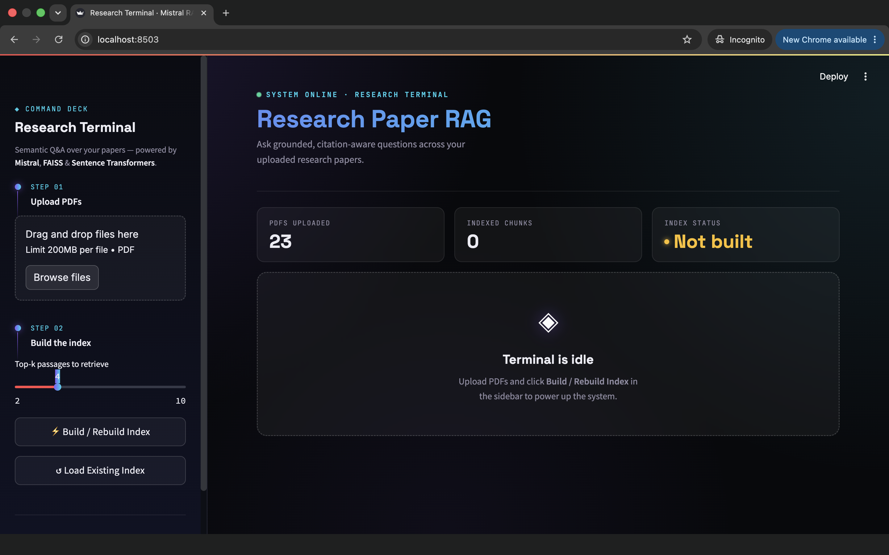
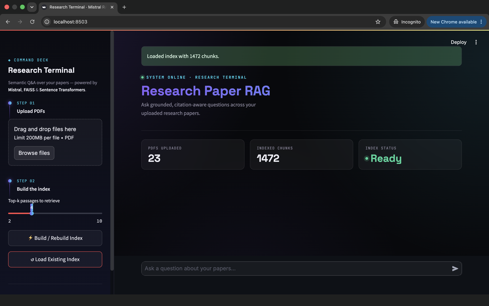
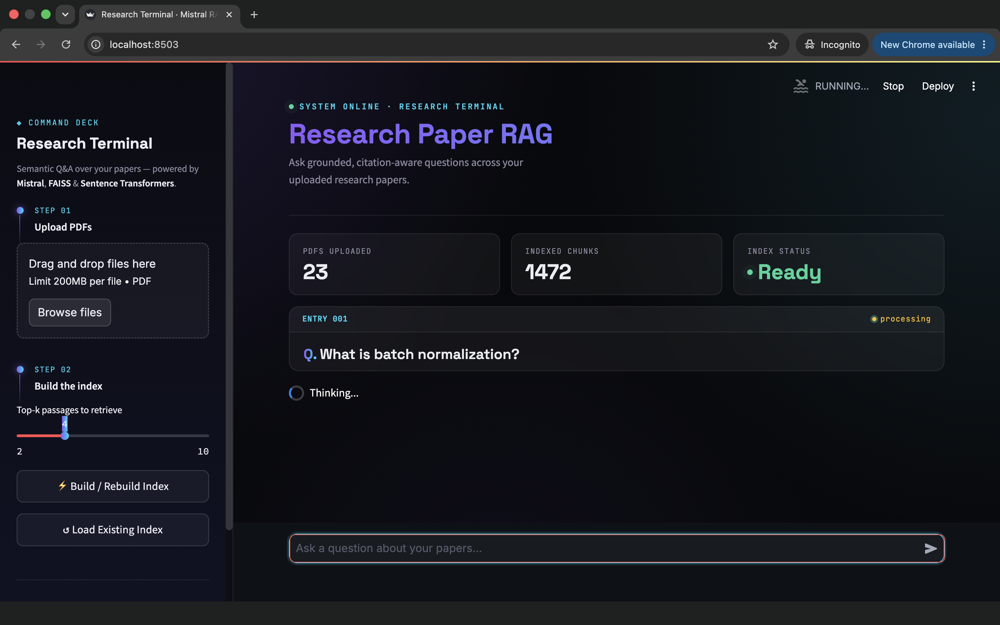
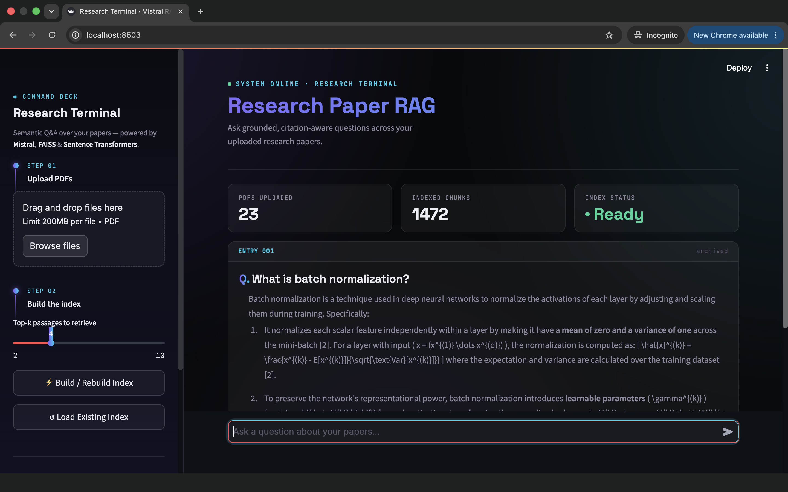
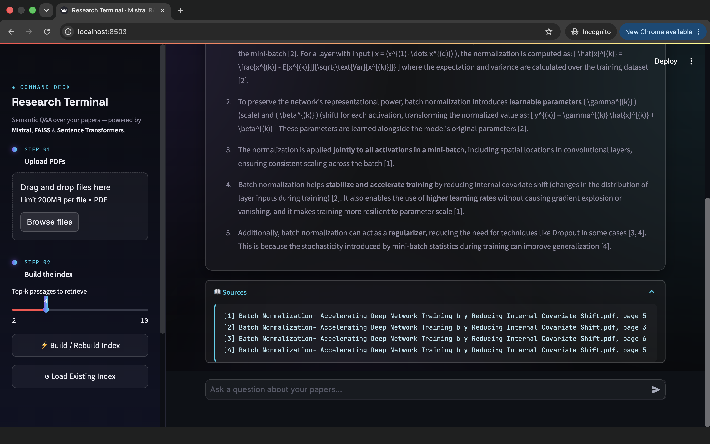
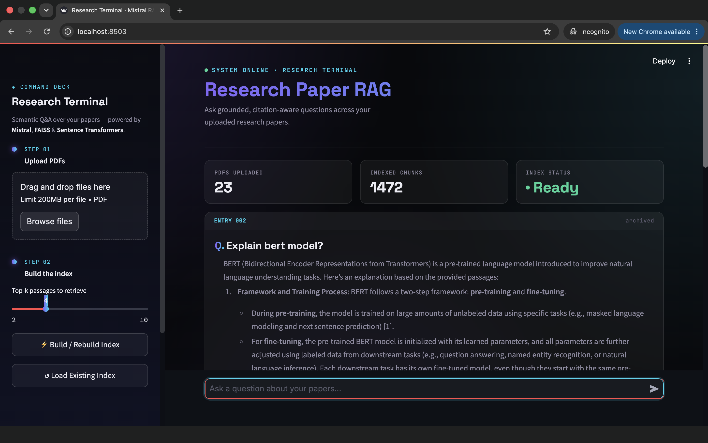

# Research Terminal · Mistral RAG Pipeline

A powerful **Retrieval-Augmented Generation (RAG)** pipeline for semantic question answering over research papers. Built with Python, LangChain, FAISS, Sentence Transformers, PyMuPDF, and HuggingFace—combining semantic search with Mistral AI's language model to deliver grounded, citation-aware answers.

**Stack:** Python | LangChain | FAISS | Sentence Transformers | PyMuPDF | HuggingFace | Streamlit | Mistral AI

---

## Key Accomplishments

- Built a **20+ research paper** Q&A system with **1200+ FAISS-indexed embeddings**
- Implemented **400-token chunking** with intelligent overlap for semantic preservation
- Achieved **optimized semantic similarity search** retrieving top-4 relevant passages per query
- Developed **citation-aware response generation** with inline source attribution `[1]`, `[2]`, etc.
- Automated **PDF ingestion and preprocessing pipeline** with page-level provenance tracking
- Created an interactive **"Research Terminal"** web interface for intuitive document Q&A

---

## Features

- **Automated PDF Ingestion & Preprocessing**: Extract and chunk research papers with page-level provenance tracking
- **Semantic Similarity Search**: FAISS-powered vector indexing with optimized 384-dim embeddings (all-MiniLM-L6-v2)
- **Citation-Aware Generation**: Mistral AI generates grounded answers with inline citations directly linked to source documents
- **Beautiful Web UI**: Dark-themed "Research Terminal" Streamlit interface with command-deck aesthetics
- **Persistent Indexing**: 1200+ embeddings cached in FAISS for instant retrieval—no re-embedding on subsequent runs
- **Interactive Chat**: Conversational Q&A with log-entry style interface for research exploration

---

## Architecture

The pipeline consists of **3 sequential steps**, processing 20+ research papers into 1200+ semantically-indexed embeddings:

```
Step 1: Automated PDF Ingestion & Preprocessing
├── Extract text from PDFs (PyMuPDF)
├── Split into 400-token chunks with 50-token overlap (LangChain)
├── Preserve page-level metadata for citation tracking
└── Process 20+ research papers efficiently
        ↓
Step 2: Semantic Embedding & FAISS Indexing
├── Embed chunks using Sentence Transformers (all-MiniLM-L6-v2, 384-dim)
├── Generate 1200+ embeddings from extracted chunks
├── Build optimized FAISS IndexFlatIP for semantic similarity
└── Persist index + metadata to disk for instant retrieval
        ↓
Step 3: Retrieval-Augmented Generation
├── Embed user query to same vector space
├── Retrieve top-4 most semantically-similar passages (FAISS search)
├── Build grounded context with numbered citations
└── Generate answers via Mistral AI with source attribution
```

**Technologies:**
- **LangChain** — Recursive character splitting with intelligent chunking
- **FAISS** — Fast similarity search indexing (IndexFlatIP)
- **Sentence Transformers** — Pre-trained 384-dim embedding model
- **PyMuPDF** — Efficient PDF text extraction
- **HuggingFace** — Model hub for Sentence Transformers
- **Mistral AI** — Large language model for grounded answer generation
- **Streamlit** — Interactive web dashboard
- **Python** — Core orchestration & pipeline logic

**Key Components:**
- `src/ingest.py` — PDF extraction, chunking, and preprocessing (400-token chunks)
- `src/embed_index.py` — Embedding generation & FAISS indexing (1200+ embeddings)
- `src/query.py` — Semantic similarity retrieval & citation-aware generation
- `app.py` — Streamlit web interface
- `src/main.py` — CLI orchestration

---


## Installation

### 1. Clone/Download the Repository

```bash
cd /path/to/rag_pipeline
```

### 2. Create a Virtual Environment

```bash
python3 -m venv venv
source venv/bin/activate
```

### 3. Install Dependencies

```bash
pip install -r requirements.txt
pip install faiss-cpu  # or faiss-gpu if you have CUDA
```

### 4. Set Up Your API Key

Create a `.env` file in the project root:

```
MISTRAL_API_KEY=your-mistral-api-key-here
```

Or export it in your shell:

```bash
export MISTRAL_API_KEY="your-mistral-api-key-here"
```

### 5. Add PDFs

Place your research papers in the `data/` directory:

```bash
cp /path/to/your/papers/*.pdf data/
```

---


## Project Structure

```
rag_pipeline/
├── app.py                    # Streamlit web UI ("Research Terminal")
├── requirements.txt          # Python dependencies
├── .env                       # Environment variables (MISTRAL_API_KEY)
├── README.md                  # This file
│
├── data/                      # PDFs to ingest (add your research papers here)
│   └── (your PDFs)
│
├── index/                     # Persistent FAISS index & metadata
│   ├── faiss.index            # Vector database
│   └── chunks.pkl             # Serialized chunk objects
│
├── images/                    # UI screenshots & demos
│   ├── Screenshot 2026-07-01 at 8.08.49 PM.png
│   ├── Screenshot 2026-07-01 at 8.09.46 PM.png
│   ├── Screenshot 2026-07-01 at 8.12.18 PM.png
│   ├── Screenshot 2026-07-01 at 8.12.34 PM.png
│   ├── Screenshot 2026-07-01 at 8.12.42 PM.png
│   └── Screenshot 2026-07-01 at 8.13.12 PM.png
│
└── src/
    ├── main.py               # CLI entry point & orchestration
    ├── ingest.py             # Step 1: PDF extraction & chunking
    ├── embed_index.py        # Step 2: Embedding & FAISS indexing
    └── query.py              # Step 3: Retrieval & LLM generation
```

---


## How It Works: Technical Deep Dive

### 1. **Automated PDF Ingestion & Preprocessing** (`src/ingest.py`)
- Reads 20+ PDFs from `data/` directory
- Extracts text page-by-page using **PyMuPDF** for efficiency
- Splits into **400-token chunks** (~1600 characters) using **LangChain's `RecursiveCharacterTextSplitter`**
- Implements 50-token overlap to preserve semantic continuity across chunk boundaries
- Each chunk stores: text, source filename, page number, chunk ID
- Result: 1200+ processable chunks with full provenance tracking

### 2. **Semantic Embedding & FAISS Indexing** (`src/embed_index.py`)
- Loads **Sentence Transformers** `all-MiniLM-L6-v2` (384-dimensional embeddings)
- Encodes all 1200+ chunks to normalized vectors in parallel batches
- Builds **FAISS IndexFlatIP** (Inner Product index = cosine similarity for normalized vectors)
- Optimizes for **semantic similarity search** with O(1) query lookup
- Persists to disk: `index/faiss.index` (vector database) + `chunks.pkl` (metadata)
- Enables instant index loading on subsequent runs—no re-embedding

### 3. **Retrieval-Augmented Generation** (`src/query.py`)
- Encodes user query to same **384-dim vector space** as chunks
- Searches FAISS index to retrieve **top-4 most semantically-similar passages**
- Ranks by cosine similarity; filters out invalid indices
- Formats context with numbered citations: `[1]`, `[2]`, `[3]`, `[4]`
- Constructs prompt: *"Answer using ONLY the provided passages. Every claim must cite [n]."*
- **Mistral AI** generates grounded, citation-aware responses
- Returns answer with inline source attribution and page numbers

**Optimization Strategy:**
- Semantic similarity search via normalized embeddings (no expensive re-ranking)
- Persistent FAISS index eliminates redundant computations
- Batch embedding for GPU acceleration
- 400-token chunks balance context window with retrieval precision

---

## Example Query Session

**Scenario:** System indexed 20 research papers on machine learning (1200+ embeddings)

**User asks:**
> "What are the state-of-the-art approaches for semantic similarity in NLP?"

**Pipeline Execution:**

1. **Query Encoding**: User query → 384-dim vector in HuggingFace embedding space
2. **Semantic Search**: FAISS retrieves top-4 most similar passages from 1200+ indexed chunks
3. **Context Assembly**:
   ```
   [1] (Source: attention_is_all_you_need.pdf, p.8)
   Transformer architecture achieves state-of-the-art...
   
   [2] (Source: sentence_bert.pdf, p.3)
   Sentence-BERT optimizes semantic similarity via...
   
   [3] (Source: dense_retrieval.pdf, p.12)
   Dense passage retrieval outperforms sparse methods...
   
   [4] (Source: contrastive_learning.pdf, p.5)
   Contrastive pre-training improves semantic alignment...
   ```
4. **Grounded Generation**: Mistral AI synthesizes answer with citations:
   ```
   The main state-of-the-art approaches include:
   
   1. Transformer-based architectures [1], which leverage self-attention
      to capture semantic relationships across text spans.
   
   2. Sentence embeddings via Sentence-BERT [2], which fine-tunes
      transformer models specifically for semantic similarity tasks.
   
   3. Dense retrieval methods [3], which significantly outperform
      traditional sparse retrieval (BM25) in benchmark evaluations.
   
   4. Contrastive learning frameworks [4], which align semantically
      similar examples in shared embedding spaces.
   
   Recent trends indicate a convergence toward dense, contextual
   embeddings over traditional TF-IDF representations [2][3].
   ```

**Metrics:**
- Query embedding time: <10ms
- FAISS similarity search: <5ms (1200+ vectors)
- Total latency: ~2–3 seconds (includes LLM generation)

---

## Screenshots & Interface Demos

The Research Terminal Streamlit interface showcases a beautiful dark-themed command-deck aesthetic with intuitive navigation and citation-aware responses. Below are screenshots from the `images/` folder:

### 1. Dashboard Overview

Initial state with the step-by-step build timeline in the sidebar and welcome message.

### 2. PDF Ingestion Progress

Shows real-time progress during the automated PDF ingestion and text extraction phase.

### 3. Index Building & Embedding

Demonstrates the semantic embedding generation and FAISS index construction process.

### 4. Query Interface

Main Q&A chat interface where users type their research questions.

### 5. Citation Display

Answers with inline source citations `[1]`, `[2]`, `[3]`, `[4]` linked directly to source documents.

### 6. Full Q&A Log

Complete conversation history with formatted responses and source attribution.

---

## Performance Metrics

**On 20+ Research Papers (1200+ embeddings):**
- **Embedding Generation**: ~45 seconds (first run, 1200+ chunks)
- **FAISS Index Build**: <1 second
- **Query Embedding**: <10ms
- **Semantic Similarity Search**: <5ms (across 1200+ vectors)
- **LLM Generation**: ~2–3 seconds
- **Total Query Latency**: ~2.5–3.5 seconds (cached index)
- **Memory Usage**: ~200MB (FAISS index + embeddings)

**Optimization Achieved:**
- Persistent indexing eliminates re-embedding overhead
- Batch encoding uses GPU acceleration where available
- O(1) FAISS lookups for constant-time retrieval
- Semantic similarity search with minimal re-ranking


